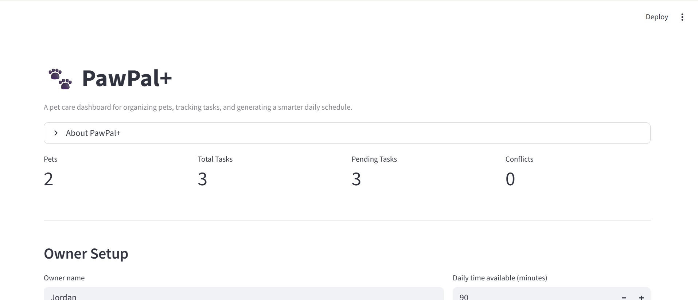
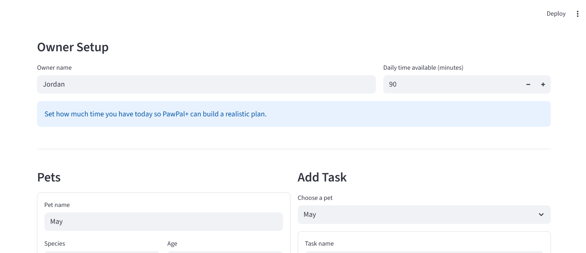
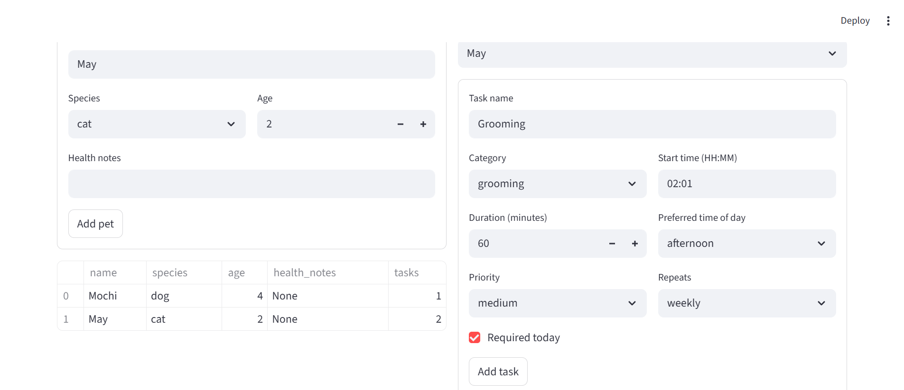
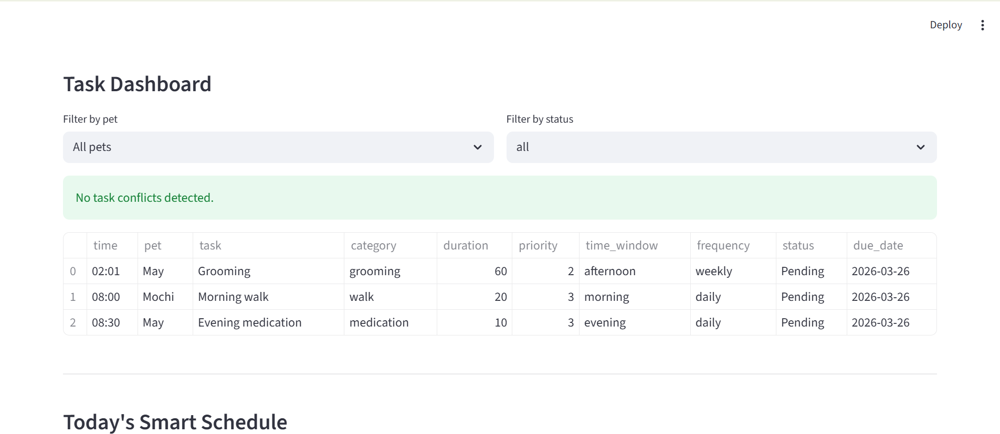
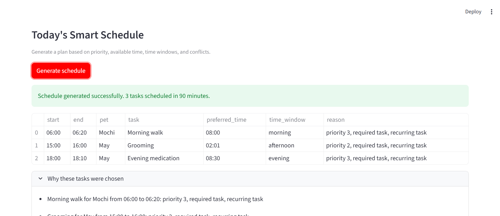
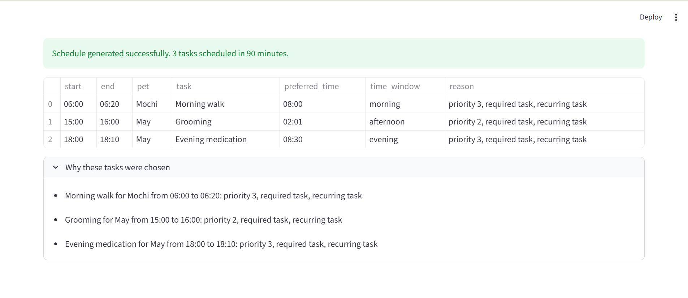

# PawPal+

PawPal+ is a pet care scheduling app built with Python and Streamlit. It helps a pet owner manage multiple pets, organize care tasks, detect time conflicts, handle recurring routines, and generate a practical daily plan based on available time and task priority.

## Project Summary

This project combines object-oriented design with scheduling logic and a dashboard-style user interface.

PawPal+ supports:

- managing one owner with multiple pets
- adding care tasks with duration, priority, time, and preferred time window
- sorting tasks by time
- filtering tasks by pet and completion status
- detecting overlapping tasks and showing warnings
- generating daily schedules across all pets
- handling daily and weekly recurring tasks by creating the next occurrence automatically
- explaining why tasks were scheduled or skipped

## Scenario

A busy pet owner needs help staying consistent with pet care. The system should:

- track pet care tasks such as feeding, walks, medication, grooming, and appointments
- consider constraints such as available time, priority, and preferred time of day
- produce a daily plan and explain the scheduler's decisions

## Key Features

### Smart Scheduling

- Tasks can be sorted chronologically using `Scheduler.sort_by_time()`.
- The scheduler prioritizes required tasks and respects broad time windows like `morning`, `midday`, `afternoon`, and `evening`.
- The daily plan is built across all pets owned by one person.
- Tasks that cannot fit the schedule are recorded with a reason.

### Filtering and Visibility

- Task lists can be filtered by pet name.
- Task lists can be filtered by completion status.
- Streamlit dashboard views show task data in a sorted and readable table.

### Recurring Task Logic

- Tasks support `none`, `daily`, and `weekly` recurrence.
- Completing a recurring task automatically creates the next dated occurrence.
- Daily tasks create the next task for the following day.
- Weekly tasks create the next task seven days later.

### Conflict Detection

- The scheduler checks for overlapping task times.
- Conflict detection returns lightweight warning messages instead of crashing the app.
- Overlaps can be shown both in the CLI demo and in the Streamlit dashboard.

### Explanation and Transparency

- The generated schedule includes reasoning for each selected task.
- Unscheduled tasks are shown with explanations such as time conflicts or not enough remaining time.

## System Design

The backend is centered around four main classes:

- `Owner`
  Stores the owner name, daily time available, preferences, and pet list.

- `Pet`
  Stores pet information and owns a list of `Task` objects.

- `Task`
  Stores scheduling details such as title, category, duration, priority, start time, preferred time window, due date, recurrence frequency, and completion state.

- `Scheduler`
  Handles sorting, filtering, recurrence workflow, conflict detection, daily plan generation, and schedule explanations.

## Final Scheduling Behaviors

The final implementation verifies these important scheduling behaviors:

- tasks are returned in chronological order when sorted by time
- completed tasks can be filtered out
- daily and weekly recurring tasks create the next instance automatically
- overlapping tasks generate warnings
- the schedule respects required status, time windows, and available time

## Project Structure

```text
.
|-- app.py
|-- main.py
|-- pawpal_system.py
|-- Mermaid.js
|-- reflection.md
|-- tests/
|   `-- test_pawpal.py
|-- image/
    |-- initial_version.png
    |-- improved_version.png
    |-- 1.png
    |-- 2.png
    |-- 3.png
    |-- 4.png
    |-- 5.png
    `-- 6.png
```

## Streamlit Dashboard

The final UI is organized as a dashboard with:

- top summary metrics
- owner setup
- pet management
- task creation
- sorted and filtered task dashboard
- conflict warnings
- schedule generation output
- schedule explanations and unscheduled task reporting

## CLI Demo

`main.py` demonstrates the backend behavior in the terminal by:

- adding tasks out of order
- printing sorted tasks
- filtering tasks by status and pet
- detecting conflicts
- generating a sample daily schedule
- showing recurring task creation after completion

Run the CLI demo with:

```bash
python main.py
```

## Getting Started

### Requirements

- Python 3.x
- packages listed in `requirements.txt`

### Setup

```bash
python -m venv .venv
```

Activate the virtual environment:

```bash
.venv\Scripts\activate
```

Install dependencies:

```bash
pip install -r requirements.txt
```

### Run the Streamlit App

```bash
streamlit run app.py
```

## Testing PawPal+

Run the automated tests with:

```bash
python -m pytest
```

The current test suite covers:

- sorting correctness
- task completion state updates
- daily recurring task creation
- weekly recurring task creation
- conflict detection for duplicate times
- pet task storage behavior

Confidence Level: 4/5 stars.

The main scheduling features are covered by passing tests, but the app would still benefit from more edge-case coverage for larger schedules, more complex overlaps, and additional Streamlit interaction scenarios.

## Demo Images

### Dashboard Overview



### Pet and Task Setup



### Task Dashboard



### Conflict and Scheduling Feedback



### Schedule Output



### Final Dashboard State



## UML and Design Evolution

This project started with an initial UML design and was later refined to match the implemented system.

Main design changes included:

- stronger links between `Owner`, `Pet`, and `Task`
- richer task attributes for time, due date, and recurrence
- a more capable `Scheduler` responsible for filtering, sorting, recurrence, conflict detection, and explanation generation

You can find the UML sources here:

- Mermaid diagram: `Mermaid.js`
- reflection notes: `reflection.md`
- images: `image/initial_version.png` and `image/improved_version.png`

## Reflection Highlights

Important tradeoffs in this project:

- the scheduler uses a simple greedy approach instead of trying every possible schedule combination
- conflict handling focuses on lightweight warnings instead of heavy optimization
- the current design favors readability and explainability over advanced scheduling complexity

## Future Improvements

Possible next steps for PawPal+:

- allow editing and deleting pets and tasks from the dashboard
- let users mark tasks complete directly in the Streamlit UI
- support richer recurrence rules beyond daily and weekly
- support exact appointments alongside flexible time windows
- add persistence with a file or database
- add more tests for larger and more complex schedules

## Authoring Notes

This project demonstrates:

- object-oriented design
- scheduling logic
- Streamlit UI design
- unit testing with `pytest`
- iterative refinement with AI-assisted design and implementation
