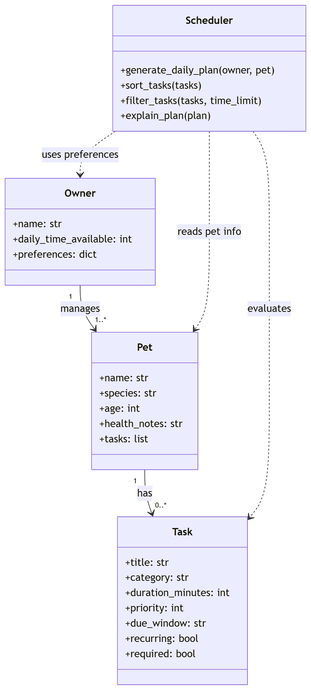

# PawPal+ Project Reflection

## 1. System Design

**a. Initial design**
- Core actions
    + Add a pet
    + Schedule vaccine appointments
    + Plan nutrious diet
- Briefly describe your initial UML design.

    My initial design uses four core classes: `Owner`, `Pet`, `Task`, and `Scheduler`. The idea is that an `Owner` manages one or more pets, each `Pet` has a list of care tasks, and each `Task` includes task name, type of care, and how long the task takes. The `Scheduler` evaluates those tasks using time limits, priorities, and owner preferences to build a daily plan.
- What classes did you include, and what responsibilities did you assign to each?
    - `Owner`: stores the owner's name, daily time available, and care preferences such as preferred walk times or medication reminders.
    - `Pet`: stores pet-specific details such as name, species, age, and health notes, and owns the list of tasks for that pet.
    - `Task`: represents one care activity with attributes like title, category, duration, priority, due window, and whether it is recurring or required.
    - `Scheduler`: contains the scheduling algorithm that sorts, filters, and selects tasks based on constraints, then returns a daily plan with explanations.

**b. Design changes**

- Did your design change during implementation?
- If yes, describe at least one change and why you made it.

---

## 2. Scheduling Logic and Tradeoffs

**a. Constraints and priorities**

- What constraints does your scheduler consider (for example: time, priority, preferences)?
- How did you decide which constraints mattered most?

**b. Tradeoffs**

- Describe one tradeoff your scheduler makes.
- Why is that tradeoff reasonable for this scenario?

---

## 3. AI Collaboration

**a. How you used AI**

- How did you use AI tools during this project (for example: design brainstorming, debugging, refactoring)?
- What kinds of prompts or questions were most helpful?

**b. Judgment and verification**

- Describe one moment where you did not accept an AI suggestion as-is.
- How did you evaluate or verify what the AI suggested?

---

## 4. Testing and Verification

**a. What you tested**

- What behaviors did you test?
- Why were these tests important?

**b. Confidence**

- How confident are you that your scheduler works correctly?
- What edge cases would you test next if you had more time?

---

## 5. Reflection

**a. What went well**

- What part of this project are you most satisfied with?

**b. What you would improve**

- If you had another iteration, what would you improve or redesign?

**c. Key takeaway**

- What is one important thing you learned about designing systems or working with AI on this project?
