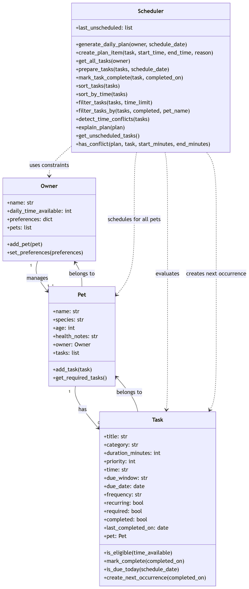

# PawPal+ Project Reflection

## 1. System Design

**a. Initial design**
- Core actions
    + Add a pet
    + Schedule vaccine appointments
    + Schedule a walk
- Briefly describe your initial UML design.

    My initial design uses four core classes: `Owner`, `Pet`, `Task`, and `Scheduler`. The idea is that an `Owner` manages one or more pets, each `Pet` has a list of care tasks, and each `Task` includes task name, type of care, and how long the task takes. The `Scheduler` evaluates those tasks using time limits, priorities, and owner preferences to build a daily plan.
- What classes did you include, and what responsibilities did you assign to each?
    - `Owner`: stores the owner's name, daily time available, and care preferences such as preferred walk times or medication reminders.
    - `Pet`: stores pet-specific details such as name, species, age, and health notes, and owns the list of tasks for that pet.
    - `Task`: represents one care activity with attributes like title, category, duration, priority, due window, completion status, and whether it is recurring or required.
    - `Scheduler`: contains the scheduling algorithm that sorts, filters, and selects tasks based on constraints, then returns a daily plan with explanations.

**b. Design changes**

- Did your design change during implementation?
    + Yes. After creating the first class skeleton, I noticed that some relationships in the UML were too simple for the actual scheduling problem.
- If yes, describe at least one change and why you made it.
    + One important change was adding stronger relationships between classes. For example, the `Pet` class should connect back to its `Owner`, and each `Task` should be clearly associated with a specific `Pet`. This makes it easier for the scheduler to explain who a task belongs to and apply owner preferences correctly.
    + Another improvement was recognizing that the scheduler needs a clearer output structure. Instead of adding another class just for scheduled results, I simplified the design so the `Scheduler` creates plan entries directly. Each entry stores the selected task, its time slot, and the reason it was chosen. This keeps the code more convenient while still making the plan easy to test and explain in the CLI or Streamlit app.
    + I would also redesign the scheduler so it can support scheduling across all pets owned by one person, not just one pet at a time. That change better matches the original scenario where one owner may manage multiple pets within the same daily time limit.
    + I also updated the `Task` design to include a completion state and a `mark_complete()` method so the system can track whether a care task has already been finished.

---

## 2. Scheduling Logic and Tradeoffs

**a. Constraints and priorities**

- What constraints does your scheduler consider (for example: time, priority, preferences)?
    + The scheduler now considers four main constraints: the owner's total available minutes, whether a task is required, the task's preferred time window (`morning`, `midday`, `afternoon`, `evening`, or `anytime`), and whether the task is recurring or already completed.
- How did you decide which constraints mattered most?
    + I treated required tasks and time windows as the most important because a pet owner usually cannot skip medication, feeding, or other urgent care tasks, and some of those tasks only make sense at certain times of day. After that, priority helps break ties, while duration helps the system fit as many useful tasks as possible into the available time.

**b. Tradeoffs**

- Describe one tradeoff your scheduler makes.
    + One tradeoff is that the scheduler uses a simple greedy algorithm and lightweight conflict checks instead of searching every possible schedule combination. It sorts tasks first, places them into the next valid time slot, and reports overlap warnings when tasks share time ranges rather than trying to automatically optimize around every conflict.
- Why is that tradeoff reasonable for this scenario?
    + That tradeoff is reasonable for this project because it keeps the code understandable and easy to explain in both the CLI and Streamlit app. The result is not mathematically perfect, but it is fast, predictable, and realistic enough for a pet owner's daily planning tool.

---

## 3. AI Collaboration

**a. How you used AI**

- How did you use AI tools during this project (for example: design brainstorming, debugging, refactoring)?
    + I used AI for design brainstorming, finding small algorithm improvements, and checking which features would best match the assignment goals. 
- What kinds of prompts or questions were most helpful?
    + The most helpful prompts were specific ones such as asking for small logic upgrades for sorting tasks by time, filtering by pet or status, handling recurring tasks, and detecting scheduling conflicts. I specifically refered to specific lines and files to ensure the AI handle the right tasks.

**b. Judgment and verification**

- Describe one moment where you did not accept an AI suggestion as-is.
    + I accepted four suggestions because they directly supported the required features: sorting tasks by time window, filtering tasks by pet and completion status, improving recurring-task handling, and adding basic conflict detection.
    + I did not accept every suggestion as-is. I rejected the idea of adding a separate `ScheduledTask` class because the existing `Scheduler` already creates plan entries clearly enough for this project, so adding another class would increase complexity without much benefit.
    + I also did not adopt ideas like fairness balancing between pets or a more advanced scoring formula. Those ideas could help in a larger system, but for this version they would make the logic harder to explain and test than the assignment required.
- How did you evaluate or verify what the AI suggested?
    + I evaluated each suggestion by checking whether it matched the assignment goals, fit the current object-oriented design, and improved the user experience without overcomplicating the app. I then verified the accepted changes by running the app logic and confirming that tasks were sorted by preferred time, filtered correctly in the interface, and reported when they were skipped because of time limits or conflicts.

---

## 4. Testing and Verification

**a. What you tested**

- What behaviors did you test?
    + I tested that tasks are sorted by required status and preferred time window, that completed one-time tasks are skipped, that recurring tasks remain eligible on a new day, that the task table can be filtered by pet and status, and that the scheduler reports tasks it cannot place because of time conflicts or limited available minutes.
- Why were these tests important?
    + These tests were important because they check the core promise of the app: helping a pet owner build a realistic daily care plan rather than just storing task data.

**b. Confidence**

- How confident are you that your scheduler works correctly?
    + I am reasonably confident that the scheduler works correctly for the main classroom scenarios because the logic now handles priority, time windows, recurrence, completion state, and basic conflict detection in a consistent way.
- What edge cases would you test next if you had more time?
    + If I had more time, I would test edge cases such as multiple tasks with the same time window, duplicate recurring tasks across many days, owners with very small time budgets, and tasks that need exact appointment times instead of broad morning or evening windows.

---

## 5. Reflection

**a. What went well**

- What part of this project are you most satisfied with?
    + I am most satisfied with how the final design connects the object-oriented model to a practical scheduling workflow. The classes stay simple, but the scheduler still produces a plan with clear explanations and now handles more realistic daily-care constraints.

**b. What you would improve**

- If you had another iteration, what would you improve or redesign?
    + In another iteration, I would improve the data model for recurring tasks by supporting daily versus weekly recurrence rules and allowing a user to mark tasks complete directly in the Streamlit interface. I would also consider adding edit and delete actions for pets and tasks.

**c. Key takeaway**

- What is one important thing you learned about designing systems or working with AI on this project?
    + One important lesson I learned is that AI is most helpful when I use it to generate focused options and then apply my own judgment. The best results came from choosing a few suggestions that matched the project scope instead of trying to accept every possible improvement.
    + I also learned that being the "lead architect" means I still have to make the final design decisions, even when collaborating with powerful AI tools. AI was useful for brainstorming algorithms, improving structure, and suggesting tests, but I had to decide which ideas fit the project's goals, which ones would make the code too complex, and how all the parts should work together as one system. In that sense, AI helped me move faster, but it did not replace the responsibility of thinking carefully about tradeoffs, clarity, and the overall design direction.
